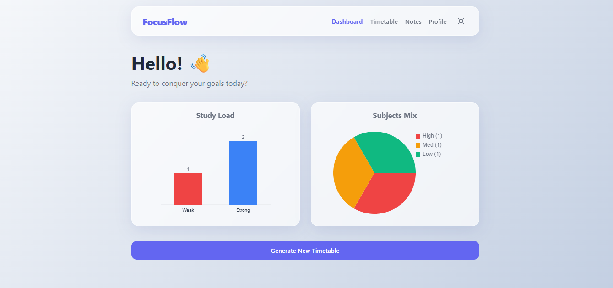
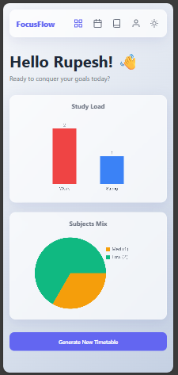
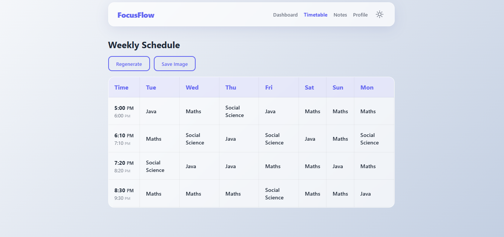
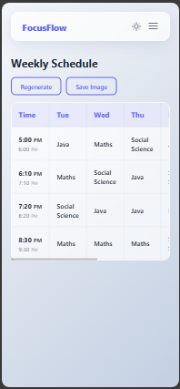

# FocusFlow - Smart Study Planner 🎓

FocusFlow is a dynamic, offline-capable Progressive Web App (PWA) designed to help students organize their study schedules efficiently. It uses an intelligent scheduling algorithm to generate balanced timetables based on subject priorities, user age, and available usage windows.


## 📸 Screenshots

| **Desktop View** | **Mobile View** |
| :---: | :---: |
| <br>_Dashboard_ | <br>_Dashboard_ |
| <br>_Weekly Schedule_ | <br>_Weekly Schedule_ |

## ✨ Features

- **Smart Scheduling**: Auto-generates weekly timetables balancing high-priority and weak subjects.
- **Overnight Support**: Seamlessly handles "Night Owl" schedules (e.g., 11 PM to 6 AM) without logical errors.
- **Offline Reminders 🔔**: Get browser notifications 10 minutes and 5 minutes before each study session (works offline!).
- **Flexible Editing**: Click any slot to change the Subject OR custom Start/End times.
- **Custom Time Ranges**: Define your own study windows or sync with school hours.
- **Offline Ready**: Fully functional offline using Service Workers and IndexedDB (PWA).
- **Data Persistence**: All data is stored locally in your browser. No login required, no cloud data.
- **Export & Share**: Save your weekly schedule or individual notes as high-quality images.
- **Analytics**: Visual charts for subject distribution and study load.

> **Note**: For reminders to work, please click "Allow" when the browser asks for Notification permissions (usually triggered on first "Generate").

## 🛠️ Tech Stack

- **Core**: Vanilla JavaScript (ES6+), HTML5, CSS3.
- **Storage**: IndexedDB (via `idb` pattern) for local data persistence.
- **Rendering**: Custom DOM manipulation, HTML5 Canvas for charts.
- **Export**: `html2canvas` for DOM-to-Image capture.
- **PWA**: Service Worker caching and manifest for installability.

## 🚀 Getting Started

Since this project uses **ES Modules** and **Service Workers**, it requires a local HTTP server to run ensuring security policies are met. It *will not* work correctly if opened directly via the file system (`file:///`).

### Prerequisites
You need a basic HTTP server. If you have Node.js installed, `http-server` is recommended.

### Installation

1.  **Clone the repository**:
    ```bash
    git clone https://github.com/yourusername/FocusFlow.git
    cd FocusFlow
    ```

2.  **Start the Server**:
    Using `npx` (requires Node.js):
    ```bash
    npx http-server -c-1 .
    ```
    *`-c-1` disables caching for development.*

    **OR** using Python 3:
    ```bash
    python -m http.server 8000
    ```

3.  **Open the App**:
    Visit `http://localhost:8080` (or the port shown in your terminal) in your browser.

## 📱 Mobile Support

FocusFlow is fully responsive. To install it on your mobile device:
1.  Open the web app in Chrome/Safari on your phone.
2.  Tap "Add to Home Screen".
3.  It will behave like a native app.

## 📄 License

This project is open source and available under the [MIT License](LICENSE).
